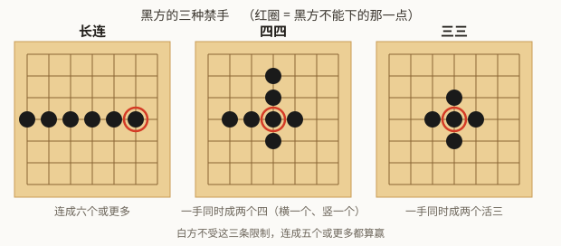

# 第 1 章　问题与五条自设的硬约束

## 1.1 先把棋规讲清楚

五子棋规则简单到一句话：轮流落子，先连成五个的赢。

问题也简单：**先手赢定了**。在自由开局的 15×15 棋盘上，先手（黑方）有必胜策略。
职业比赛因此不玩裸五子棋，而玩**连珠（Renju）** —— 给黑方加上限制来抵消先手优势。

本项目采用 RIF（国际连珠联盟）标准，自由开局：

- **白方**没有任何限制，连成五个或更多（含长连）都算赢。
- **黑方**必须**恰好**五个才算赢，并且不许形成三种棋型，称为**禁手**：

| 禁手 | 含义 |
|---|---|
| **长连** | 一条线上连成六个或更多 |
| **四四** | 一手同时形成两个"四" |
| **三三** | 一手同时形成两个"活三" |

图里每个红圈标出的都是**黑方不能下的那一点**：下上去就形成了对应的禁手。

还有两条细则，后面会反复用到：

- **五连优先**：黑方一手同时成五和成禁手时，算黑胜。赢棋优先于犯规。
- **禁手语义**：本项目采用**严格 RIF** —— 禁手点仍然是**合法落子**，黑方落上去
  **立即判负**。这条选择很关键，1.3 节会解释为什么。

## 1.2 五条硬约束

这个项目一开始就给自己设了五条限制。它们不是外部要求，是有意为之：

| 约束 | 具体含义 |
|---|---|
| **零棋谱** | 全部知识来自游戏规则本身。训练和测试数据都由程序自己产生，不接触任何人类对局记录 |
| **零搜索推理** | 对战时没有树搜索、没有 rollout、没有开局库。网络看一眼棋盘就落子 |
| **自研结构** | 网络结构自己设计，不复用任何开源五子棋 AI 的模型结构 |
| **零预训练权重** | 全部从随机初始化开始 |
| **BF16 主权重** | 模型权重本身就是 BF16，不是常规的"FP32 主权重 + BF16 混合精度" |

前四条比较好理解。第五条是个数值上的自找麻烦，第 5 章整章在讲它。

真正定义了这个项目的是**第二条**。

## 1.3 为什么"不许搜索"让整件事变难了

先说清楚 AlphaZero 这类方法是怎么下棋的。它有两个部件：

1. **一个神经网络**，输入棋盘，输出"每个点该下的概率"（策略）和"我现在是赢是输"（价值）；
2. **一棵搜索树**（MCTS），反复调用这个网络去试探"如果我走这里、对手走那里、然后……"，
   把试探结果统计起来，最后按统计量落子。

关键事实是：**这两者的贡献大致对半开**。同一份权重，带搜索的版本比不带搜索的版本强很多 ——
网络提供直觉，搜索负责验证直觉、修正直觉。把搜索拿掉，剩下的裸策略网络通常弱一大截。

本项目要做的，就是**把搜索的能力尽可能压进权重里**，让网络一眼就给出接近"想了几百步"
的答案。项目名 instinct（本能 / 棋感）就是这个意思。

训练期允许用 MCTS —— 但只作为**老师**：它生成更好的落子分布，网络去模仿。
部署时老师就撤了。

为此在四个层面做了针对性设计，每一条后面都有对应章节：

| 设计 | 想法 | 章节 |
|---|---|---|
| 网络走「深而窄」 | 用网络深度替代搜索深度 —— 搜索是一层层往下看，深网络也是一层层往上抽象 | 第 4 章 |
| 辅助监督头 | 把本该由树展开才能得到的信息（棋型、禁手点、对手应手）直接作为监督目标灌进网络 | 第 4、7 章 |
| 部署分布自博弈 | 一部分对局由**零搜索策略**执行落子，但训练目标仍由 MCTS 生成，消除训练与部署的分布差异 | 第 7 章 |
| 失误挖掘 | 定向采集"零搜索会走错、而且错得厉害"的局面加权重训 | 第 7 章 |

评测也必须在零搜索模式下做，否则会优化错目标 —— 第 9 章。

## 1.4 顺带解释：为什么禁手点仍然算合法落子

前面提到本项目选了严格 RIF 语义：禁手点可以下，下了立即判负。

另一种可选语义是"禁手点非法，根本不在可落子集合里"。那样实现更省事：动作空间直接把
禁手点抠掉，模型永远不可能犯规。

选难的那条，是因为它更贴合本项目的命题：**避开禁手必须是模型自己学会的能力**。
如果引擎替它挡掉，那就等于在推理时偷偷开了个规则外挂 —— 而外挂正是"零搜索"这条约束
想排除的东西。

代价是真的会犯规。实测这个模型的禁手告负率在 0.09%~0.52% 之间，不是零。
第 7 章会讲为了把这个数字压下来，损失函数里加了什么。

这条选择还有一个意想不到的好处，第 6 章会讲到：MCTS 会**自动**学会规避禁手点，
而且这个行为可以被直接蒸馏进策略网络。

---

## 代码索引

| 文件 | 符号 | 作用 |
|---|---|---|
| `configs/rules.yaml` | `forbidden` | 禁手开关与语义（`semantics: lose` = 严格 RIF） |
| `gomoku_instinct/rules/constants.py` | `ForbiddenSemantics` | `LOSE` / `ILLEGAL` 两种语义 |
| `gomoku_instinct/rules/game.py` | `Game` | 对局状态机，落子后按语义判定胜负 |

上一章：[导读](00-orientation.md)　　下一章：[规则引擎](02-rules-engine.md)
