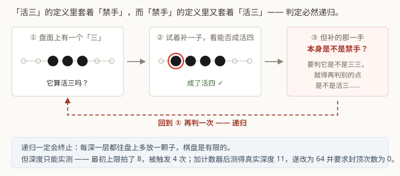
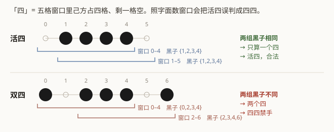

# 第 2 章　规则引擎

## 2.1 为什么这一章排在网络之前

在一个自博弈项目里，规则引擎不是配角，它是**数据的唯一来源**。

想想数据是怎么来的：程序自己下棋 → 规则判定谁赢了 → 赢的那方的着法得到正向信号。
再加上本项目额外用规则导出了一大堆监督标签（每个点是什么棋型、哪些点是黑方禁手、
还剩几手结束）。

于是：**规则判错了，训练信号就是错的，而且不会有任何报错。** loss 照样下降，
只是它在拟合一套错误的棋规。等你发现时，已经烧掉了几十小时的机器时间。

这是整个项目里唯一一个具有这种性质的模块，所以它被单列成一个里程碑，并设了硬性
验收门槛：**不通过就不往下走**。

## 2.2 一个只有两行、却很容易写错的定义

三种禁手里，长连最简单（数一下连子数），四四次之，**三三最难** —— 因为"活三"
的定义是**递归**的：

> 一个"三"算作**活三**，当且仅当存在某个空点，黑方下上去能形成**活四**，
> **并且那一手本身不是禁手**。

注意最后半句。判断"这里是不是活三"，需要先判断"另一个点是不是禁手"，
而那个判断又可能需要判断第三个点……

递归会终止，因为每深一层都往盘上多放一颗子，棋盘是有限的。但**递归有多深**
是个经验问题，不是能推导出来的。

### 一个只有靠观测才能发现的问题

最初给递归深度拍了个上限 8，超过就当作"不是活三"返回。

差分测试第一次跑就报出：**封顶被触发了 4 次**。

这说明真实需要的深度超过 8。如果没有那个计数器，超限的判定会**悄悄退化成近似**，
不报错、不抛异常、测试也不一定红 —— 只是某些三三局面被判成了非禁手，训练信号带上
系统性偏差。

加上"实际最大递归深度"计数器后测得真实深度是 **11**。于是把上限提到 64，
并把**"封顶次数必须为 0"写进验收条件**。

这类审计计数器在规则层是必须的，不是可选的。第 11 章会把这个模式推广开讲。

## 2.3 「四」到底该怎么数

RIF 把"四"定义为：**一个五格窗口内，己方占四格、剩下一格为空**。

照字面实现会出错。看这两个形状：

上面那个 `.XXXX.` 是**活四** —— 黑方的正常胜着，两端都能成五，白方挡不住。
但按字面数窗口，它含有**两个**符合定义的五格窗口（往左补一格成五、往右补一格成五），
会被误判成"四四禁手"。

真正的判据是：**这两个四是不是共用同一组棋子**。

- `.XXXX.`：两个窗口里的黑子集合都是 `{1,2,3,4}` → 同一个四 → 活四，合法。
- `X.XXX.X`：两个集合分别是 `{0,2,3,4}` 和 `{2,3,4,6}` → 两个不同的四 → 四四禁手。

两份实现都按黑子集合去重（Python 用 `frozenset`，C++ 用位掩码），这两种形状因此
能被正确区分。测试里为这条分界线专门写了一对用例。

## 2.4 两份实现，一个规范

规则层写了**两遍**，做法故意不同：

| | Python 参考实现 | C++ 实现 |
|---|---|---|
| 位置 | `gomoku_instinct/rules/` | `csrc/renju.{h,cpp}` |
| 数据结构 | 抽出定长一维列表，逐格扫描 | 每条直线打包成 `uint32_t` 位掩码 |
| 判定方式 | 直接比较格子取值 | 窗口位运算 + popcount |
| 越界处理 | 返回 `WALL` 哨兵 | 靠"线本来就只有那么长"自然排除 |
| 优先 | 可读性 —— 它是规则的**可执行规范** | 速度 |
| 用途 | 只用于差分测试 | 训练与自博弈实际使用 |

为什么要写两遍？因为**同一个人用同一种思路写两遍，会犯同样的错**。做法不同，
结果一致，才说明规则本身理解对了。

C++ 侧的位掩码表示值得多说一句：`MAX_SIZE = 32` 不是随便定的 —— 一条线上最多 32 格，
正好塞进一个 `uint32_t`，于是"这条线上黑子的分布"就是一个整数，
"窗口内有几个黑子"就是一次 `popcount`。判定完全跑在一维整数上，没有任何边界判断。

### 一条与实现无关的检查

除了差分测试，还加了一项**不依赖任何一份实现**的性质检查：

> 规则在棋盘的**八重二面体对称**（4 个旋转 × 2 个镜像）下必须完全不变。

如果把一个局面旋转 90° 再判定，结果必须和原局面旋转后的结果一一对应。
这条性质能独立抓出"把副对角当主对角处理"这类方向性 bug —— 而这种 bug 在差分测试里
可能两份实现都错得一样（如果你两次都从同一个方向表里抄）。

这套对称变换后来还被复用成了训练数据增强，见第 7 章。

## 2.5 验收结果

局面由四种随机分布生成（均匀撒子 / 聚集撒子 / 黑子占多数的密集局面 / 随机合法对局
中途局面），全部由程序生成。它们只作为规则判定的输入，**不进入训练或测试数据** ——
零棋谱那条约束在这里也成立。

| 项 | 结果 |
|---|---|
| 逐点判定比对 | 1.61 亿次，零不一致 |
| 覆盖到的禁手点 | 75.3 万个（长连 16.9 万 / 四四 27.1 万 / 三三 31.3 万） |
| 八重对称不变性 | 2.0 万次抽检，零失败 |
| 实际递归深度 | 11（上限 64，从未触顶） |
| 吞吐 | 约 350 万次判定/秒（128 进程） |

除了差分测试，还有一套**按规则条文构造**的边界用例
（`tests/test_rules_reference.py`，24 个测试函数），每个用例的注释都写清了棋型和
判定理由，可以人肉复核 —— 差分测试只能证明"两份实现一致"，证明不了"一致地对"。
两者缺一不可。

---

## 代码索引

| 文件 | 符号 | 作用 |
|---|---|---|
| `csrc/renju.h` | `Rules` | C++ 规则判定器（位掩码实现） |
| `csrc/constants.h` | `MAX_SIZE` | 一条线最多 32 格，正好装进 uint32_t |
| `csrc/constants.h` | `Level` | 7 级棋型标签，威胁监督头的标签空间 |
| `gomoku_instinct/rules/renju.py` | `RenjuRules` | Python 参考实现，规则的可执行规范 |
| `gomoku_instinct/rules/symmetry.py` | `index_map` | 八重二面体对称的落点重排表，既做不变性检查也做数据增强 |
| `gomoku_instinct/rules/generate.py` | `random_position` | 四种分布的随机局面生成器 |
| `scripts/diff_test_rules.py` | `main` | 全量差分测试（M1 验收门槛） |
| `tests/test_rules_reference.py` | `test_open_four_is_not_double_four` | 2.3 节那条分界线的用例 |

上一章：[问题与约束](01-problem.md)　　下一章：[把棋盘变成张量](03-board-to-tensor.md)
