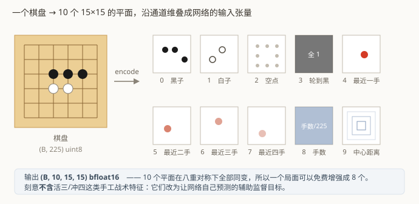

# 第 3 章　把棋盘变成张量

## 3.1 一个棋盘长什么样

内部表示极简：一个长度 `225` 的字节数组，取值 `0=空 / 1=黑 / 2=白`。落点用一维下标
`move = 行 * 15 + 列` 表示。

网络吃不了这个。它要的是形状规整的浮点张量。这一章讲怎么转。

## 3.2 十个输入平面

编码结果是一个 `(B, 10, 15, 15)` 的张量 —— 10 个 `15×15` 的"图"，沿通道维叠起来。



| # | 平面 | 内容 |
|---|---|---|
| 0 | `PLANE_BLACK` | 这一格是黑子吗（0/1） |
| 1 | `PLANE_WHITE` | 这一格是白子吗 |
| 2 | `PLANE_EMPTY` | 这一格是空点吗 |
| 3 | `PLANE_SIDE_IS_BLACK` | 现在轮到黑走吗（整个平面同一个值） |
| 4–7 | `PLANE_HISTORY_FIRST` +0..3 | 最近四手各自的落点（下标 0 是最近一手） |
| 8 | `PLANE_MOVE_NUMBER` | 已下手数 ÷ 225（整个平面同一个值） |
| 9 | `PLANE_CENTER_DIST` | 到棋盘中心的归一化切比雪夫距离（常数平面） |

几个值得解释的选择：

**平面 0/1/2 是冗余的** —— 知道黑子和白子的位置，空点自然就知道了。但显式给出来
让第一层卷积省去了一次"两个平面取反再与"的推导，代价只是一个通道。

**平面 3 用的是"是不是黑方"，不是"是不是己方"。** 常见做法是把棋盘翻转成"己方/对方"
视角，这样网络只需学一套。这里**故意不这么做**，因为连珠规则是不对称的：禁手只约束黑方。
把黑白身份直接告诉网络，比让它从别处推断要省事。

**平面 4–7 是历史落点。** 单看一个静态棋盘，看不出对手刚才在哪里发力。给最近四手，
网络就能把"对方正在这一带做文章"这件事编码进来。

**平面 8/9 是常数平面。** 手数让网络知道现在是开局还是残局；中心距离给它一个位置先验
（卷积本身是平移不变的，不知道自己在棋盘的哪里）。

### 一个自洽性上的好处

这 10 个平面在**八重二面体对称**下全部同变 —— 把棋盘旋转 90°，每个平面也跟着旋转 90°，
没有哪个平面会"错位"。这不是巧合，是挑选平面时的一条硬要求，因为第 7 章的训练数据
增强要靠它：一个局面可以免费变成 8 个。

如果加一个"距离左上角的距离"这种不同变的平面，8 倍增强就悄悄错了。

## 3.3 刻意不喂的东西

一个非常自然的想法是：既然已经有了规则引擎，为什么不把"这里有个活三"
"那里是个冲四"直接算好喂给网络？那不是省事多了？

**这个项目故意不这么做。**

理由是：手工战术特征把"什么算威胁"这件事**替网络定义好了**。网络会学到"看到活三平面
就紧张"，但它永远不会学到"为什么活三危险"，也无法发现任何你没编码进去的棋型。

取而代之的做法是：**把这些棋型改成辅助监督目标**（第 4 章的威胁头）。
即"我不告诉你哪里有活三，但我要求你自己看出来"。这样：

- 网络必须自己长出威胁识别能力，这个能力可以泛化到你没想到的形状；
- 训练时有明确的梯度信号推着它学，比纯靠策略/价值的间接信号快得多；
- 部署时这些头可以完全不用 —— 能力已经压进主干了。

实测威胁识别准确率能到 99.4%，已经饱和。第 12 章会讨论一个更微妙的问题：
**它看得见威胁，却不见得会用**。

## 3.4 编码只写一份

编码逻辑写在 Python 侧（`gomoku_instinct/model/features.py`），C++ 侧**不重复实现**。

C++ 的自博弈 runner 只吐出原始数据 —— 棋盘字节、行棋方、最近几手、手数 —— 由 Python
统一编码。这样"编码规范"只有一份，不会出现 C++ 和 Python 两边悄悄走样、
而训练与自博弈各用一套的情况。

代价是每轮要传 `对局数 × 225` 字节到 Python。1024 局也就 225 KB，相对于一次 GPU 前向
可以忽略。

## 3.5 合法性掩码

```python
def legal_mask(boards, ...):
    return boards == EMPTY
```

就这一行。**只排除已经有子的点，不屏蔽禁手点。**

原因在第 1 章讲过：严格 RIF 语义下禁手点是合法落子，避开它是模型要学的能力。
这一行在第 10 章还会再出现一次 —— 它是零搜索部署时**唯一**的非模型逻辑。

## 3.6 形状一览

把整条路径的张量形状串起来（`B` = batch，`N` = 225）：

```
boards        (B, N)      uint8    棋盘，0/1/2
to_move       (B,)        uint8    轮到谁
history       (B, 4)      int64    最近四手的落点下标，不足补 -1
move_number   (B,)        int64    已下手数
      │
      │  encode(...)
      ▼
planes        (B, 10, 15, 15)  bfloat16
      │
      │  InstinctNet.forward(...)
      ▼
policy        (B, N)           策略 logits（未屏蔽）
value         (B, 3)           胜 / 和 / 负
threat        (B, 2, 7, N)     己方与对方的逐点棋型等级
forbidden     (B, N)           黑方禁手点 logits
plies         (B, 16)          剩余手数分桶
reply         (B, N)           对手应手分布 logits
```

后四项是辅助头，`forward(planes, with_aux=False)` 可以跳过它们 —— 自博弈时每秒要跑
几万个局面，不需要辅助输出。

---

## 代码索引

| 文件 | 符号 | 作用 |
|---|---|---|
| `gomoku_instinct/model/features.py` | `encode` | 原始数据 → `(B, 10, 15, 15)` |
| `gomoku_instinct/model/features.py` | `NUM_PLANES` | 输入平面数 = 10 |
| `gomoku_instinct/model/features.py` | `legal_mask` | 只排除已占点 |
| `gomoku_instinct/model/features.py` | `center_distance_plane` | 常数平面，按尺寸缓存 |
| `gomoku_instinct/model/net.py` | `NetOutput` | 所有输出头的容器 |

上一章：[规则引擎](02-rules-engine.md)　　下一章：[网络结构 InstinctNet](04-network.md)
