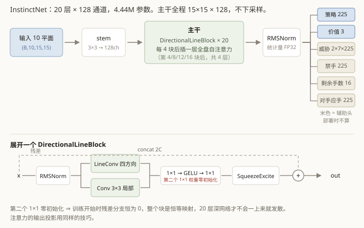
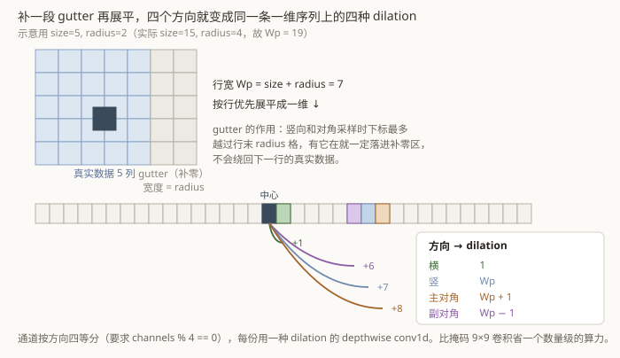

# 第 4 章　网络结构 InstinctNet

这一章讲网络本身。它的每一处设计都能追溯回第 1 章那条约束：**部署时不许搜索**。



## 4.1 深而窄：用网络深度替代搜索深度

默认规模是 **20 层 × 128 通道，4.44M 参数**。按现在的标准这是个很小的网络，而且形状
偏"瘦长"。两个理由：

**其一，深度对应搜索深度。** 搜索是一层层往下推演"我走这、他走那、然后……"；
深网络也是一层层往上抽象"这里有个三 → 这个三配那个四是个双威胁 → 所以这块棋有问题"。
既然要用权重顶替搜索，加容量就该优先加**层数**而不是宽度。

**其二，这个尺度下推理是访存受限的。** 实测（单卡，batch 2048，BF16，torch.compile 后）：

| 通道数 | 参数量 | 推理吞吐 |
|---|---|---|
| 128 | 4.44M | 52,400 局面/s |
| 192 | 9.95M | 32,800 局面/s |
| 256 | 17.66M | 25,500 局面/s |

参数涨 4 倍，吞吐掉到 0.49 倍 —— 几乎与通道数成反比，说明瓶颈在搬数据不在算数。
而**自博弈吞吐是整个项目的全局瓶颈**（数据得自己生产），网络慢一半就等于训练数据少一半。

## 4.2 把「五子棋只发生在直线上」写进结构

五子棋的全部胜负判定、全部棋型，都发生在四条方向的直线上：横、竖、主对角、副对角。
这是一个很强的结构先验，值得直接写进网络，而不是指望它从 3×3 卷积堆叠中自己学出来。

问题是怎么高效地做"沿对角线的长卷积"。

**朴素做法**：用一个带掩码的 9×9 卷积，只保留对角线上的 9 个抽头，其余 72 个置零。
能用，但 81 个乘加里只有 9 个有用，浪费一个数量级。

**实际用的做法**要绕一个小弯，但换来的是纯粹的一维卷积：



在特征图右侧补上 `radius = 4` 列零（叫 gutter，"边沟"），行宽从 15 变成 `Wp = 19`，
然后把整张图按行优先**展平成一维序列**。这时候：

| 方向 | 在一维序列上相邻元素的下标差 | dilation |
|---|---|---|
| 横 | +1 | `1` |
| 竖 | +19（下一行同列） | `Wp` |
| 主对角（右下） | +20（下一行右一列） | `Wp + 1` |
| 副对角（左下） | +18（下一行左一列） | `Wp - 1` |

**四个方向变成了同一条一维序列上四种不同 dilation 的 depthwise conv1d。**

gutter 的宽度恰好取核半径 `radius`，这是关键：沿竖直或对角方向采样时，下标最多越过
行末 `radius` 个位置 —— 有 gutter 在，这些抽头一定落进补零区，而**不会绕回下一行的
真实数据**。少补一列，网络就会学到棋盘右边缘和左边缘"接在一起"这种鬼东西，
而且不报错。

通道按方向四等分（因此要求 `channels % 4 == 0`），每 32 个通道负责一个方向。

这个下标推导差一格就会静默地把对角线采到别处，所以测试里专门写了一份朴素的二维
参考实现做逐点比对（`tests/test_model.py`），另有单独的用例验证 gutter 确实挡住了
跨行串扰。

## 4.3 主干块的构造

每个 `DirectionalLineBlock` 是一个残差块：

```
x ──► RMSNorm ──┬─► LineConv (四方向，核长 9)  ─┐
                └─► Conv2d 3×3 (局部形状)      ─┴─► concat (2C)
                                                    │
                                          1×1 → GELU → 1×1 (回到 C)
                                                    │
                                            SqueezeExcite 门控
                                                    │
x ──────────────────────────────────────────────► + ──► 输出
```

- **两路并联**：一路管长距离的直线关系，一路管局部形状（比如"这两颗子挨着"）。
- **SqueezeExcite**：全局平均池化 → 压缩 → 激活 → 还原 → sigmoid，得到每个通道一个
  0~1 的权重。作用是让网络能根据全局态势调节各通道的重要性。
- **`mix2` 的权重初始化成全零**。于是训练刚开始时每个块的残差分支输出恒为 0，
  **整个块是恒等映射**。20 层深网络在随机初始化下很容易一开始就发散，
  零初始化让它从"一个什么都不做的网络"平滑地长出来。同样的技巧也用在注意力的输出投影上。

关于 **RMSNorm2d**：沿通道维做 RMS 归一化。有一个细节 —— **统计量在 FP32 下计算再转回**。
主权重是 BF16，直接在 BF16 下求平方和，通道数一多就会掉精度甚至溢出。
这是第 5 章那类问题的一个小预演。

## 4.4 注意力：从轴向改成全局

原计划用**轴向注意力**（分别在行、列、两条对角线上做注意力），这是处理棋盘类问题的
常见省算力做法。

后来直接改成了**全盘自注意力**，理由很简单：15×15 只有 **225 个位置**。
225 个 token 的全局注意力，开销和一个卷积块差不多，而表达力严格更强 ——
它能建模任意两点之间的关系，不限于同一条直线。这对连珠很重要，因为"四三"
"双三"这类杀招恰恰需要两处**不在同一条线上**的威胁互相支援。

默认每 4 个块插一层注意力。注意：**20 个块只会插 4 层**，不是 5 层 ——
最后一个块之后不插（第 20 块后直接进 final norm）。

### 一个花了 3 倍时间的坑

第一版注意力慢得离谱。原因是 q/k/v 经过 `transpose` 之后**最后一维的 stride 不是 1**，
PyTorch 的 `scaled_dot_product_attention` 检测到这一点就**悄悄退回 math 路径** ——
把 `(B, heads, 225, 225)` 的注意力矩阵整个 materialize 出来，而不是走 flash 路径。

没有警告、没有报错，只是慢。加上 `.contiguous()` 之后：

| | 单层注意力耗时 | 整网吞吐 |
|---|---|---|
| 非连续（math 路径） | 6.64 ms | 21,200 局面/s |
| 连续（flash 路径） | 2.12 ms | 26,100 局面/s |
| 再加 torch.compile | | 52,400 局面/s |

## 4.5 六个输出头

| 头 | 结构 | 输出 | 用途 |
|---|---|---|---|
| **策略** | `Conv2d(C, 1, 1)` | `(B, 225)` logits | 主目标：模仿 MCTS 的访问分布 |
| **价值** | 池化 → `Linear(2C, C)` → GELU → `Linear(C, 3)` | `(B, 3)` | 胜 / 和 / 负三分类，**行棋方视角** |
| **威胁** | `Conv2d(C, 2×7, 1)` | `(B, 2, 7, 225)` | 每个点、己方与对方各自的棋型等级 |
| **禁手** | `Conv2d(C, 1, 1)` | `(B, 225)` | 黑方禁手点 |
| **剩余手数** | `Linear(C, 16)` | `(B, 16)` | 还有几手结束，分 16 桶 |
| **对手应手** | `Conv2d(C, 1, 1)` | `(B, 225)` | 对手下一手会走哪 |

后四个是**辅助监督头**，标签全部由规则免费导出（第 7 章讲怎么算、怎么加权）。
它们在部署时完全不用 —— `forward(planes, with_aux=False)` 直接跳过。

两个值得注意的设计：

**策略头是纯卷积的，没有展平后的全连接层。** 这意味着网络结构与棋盘尺寸无关，
同一份代码在 9×9 和 15×15 上都能跑 —— 第 8 章的 M5 小棋盘验证就利用了这一点
（那次验证是重新训练，不是迁移权重）。

**价值头是三分类而不是回归。** 输出 `softmax` 后取 `P(胜) − P(负)` 得到一个 `[-1, 1]`
的标量。三分类比直接回归一个标量更稳，也顺带给出了和棋概率。

价值头的池化用的是 `mean` 和 `amax` **拼接**（因此 `Linear` 的输入是 `2C`）：
平均池化反映整体态势，最大池化能捕捉"盘上存在一个极危险的点"这种局部信号，
只用平均会把它稀释掉。

## 4.6 从输入到输出走一遍

```python
planes = encode(boards, to_move, history, move_number, size=15)  # (B, 10, 15, 15)
x = stem(planes)                                   # (B, 128, 15, 15)
for block in trunk:                                # 20 个 block + 4 层注意力
    x = block(x)                                   # 形状始终 (B, 128, 15, 15)
x = final_norm(x)
policy = policy_head(x).flatten(1)                 # (B, 225)
pooled = cat([x.mean((2,3)), x.amax((2,3))], 1)    # (B, 256)
value  = value_head(gelu(pool_proj(pooled)))       # (B, 3)
```

主干里**特征图尺寸从头到尾都是 `15×15`，通道数从头到尾都是 128** ——
没有下采样、没有金字塔。棋盘上每个交叉点都同等重要，池化掉分辨率没有好处。

---

## 代码索引

| 文件 | 符号 | 作用 |
|---|---|---|
| `gomoku_instinct/model/net.py` | `InstinctNet` | 网络主体 |
| `gomoku_instinct/model/net.py` | `ModelConfig` | 全部超参与默认值 |
| `gomoku_instinct/model/net.py` | `value_scalar` | 三分类 → `P(胜)−P(负)` |
| `gomoku_instinct/model/net.py` | `masked_policy` | 屏蔽非法点；注释写明**不**屏蔽禁手点 |
| `gomoku_instinct/model/blocks.py` | `LineConv` | gutter + 四种 dilation 的直线卷积 |
| `gomoku_instinct/model/blocks.py` | `DirectionalLineBlock` | 主干残差块 |
| `gomoku_instinct/model/blocks.py` | `GlobalAttention` | 全盘自注意力（含 contiguous 那条注释） |
| `gomoku_instinct/model/blocks.py` | `RMSNorm2d` | 统计量在 FP32 下算 |
| `tests/test_model.py` | `test_line_conv_matches_naive_reference` | 直线卷积与朴素二维实现逐点比对 |
| `tests/test_model.py` | `test_line_conv_gutter_prevents_row_wraparound` | 验证 gutter 确实挡住了跨行串扰 |
| `tests/test_model.py` | `test_blocks_start_as_identity` | 验证零初始化让每个块从恒等映射起步 |
| `scripts/bench_model.py` | `main` | 通道数-吞吐基准 |

上一章：[把棋盘变成张量](03-board-to-tensor.md)　　下一章：[BF16 主权重与 Kahan 补偿](05-bf16-optimizer.md)
