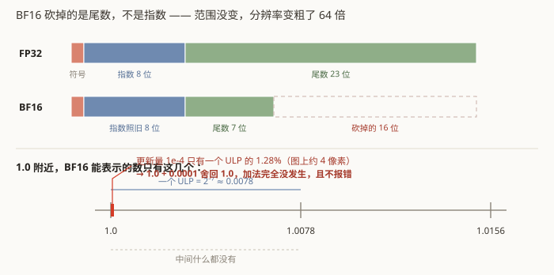
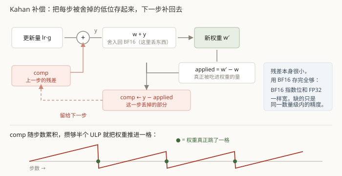

# 第 5 章　BF16 主权重与 Kahan 补偿

这一章处理第 1 章那条自找麻烦的约束：**模型的主权重本身就是 BF16**。

先说清楚它和常见做法的区别。通常说的"混合精度训练"是：**权重用 FP32 存**（叫 master
weights），前向和反向时临时转成 BF16 算，更新时更新的是 FP32 的那份。本项目不是 ——
**权重就只有一份，就是 BF16**，`optimizer.step()` 直接改它。

这会撞上一堵墙。

## 5.1 浮点数的分辨率

一个浮点数由三段组成：符号位、指数位、尾数位。指数决定数量级，尾数决定这个数量级里的
精度。



| | 符号 | 指数 | 尾数（存储） | 有效位 |
|---|---|---|---|---|
| FP32 | 1 | 8 | 23 | 24（含隐含位） |
| BF16 | 1 | 8 | **7** | 8 |

BF16 的设计取舍是：**指数位和 FP32 一样宽**（所以数值范围一样，不容易上下溢），
但尾数砍到只剩 7 位。这对前向传播够用 —— 神经网络对权重的小扰动本来就不敏感。

关键概念是 **ULP**（unit in the last place）：一个浮点数和它相邻的下一个可表示数之间的
距离。在 1.0 附近：

- FP32 的 ULP ≈ `2⁻²³` ≈ 1.2 × 10⁻⁷
- BF16 的 ULP ≈ `2⁻⁷` ≈ **7.8 × 10⁻³**

也就是说，BF16 在 1.0 附近**只能表示 1.0、1.0078、1.0156……** 中间什么都没有。

## 5.2 于是 `w += lr * g` 什么都没发生

训练中期，学习率降下来、梯度也变小，一次更新量 `lr * g` 很容易小到 10⁻⁴ 量级。
而 1.0 附近的半个 ULP 是 `2⁻⁸` ≈ 3.9 × 10⁻³。

`1.0 + 0.0001` 在 BF16 里的结果是 —— **`1.0`**。四舍五入回原值。

这不是理论推演。M0 阶段的环境自检里直接测了（`scripts/check_env.py` 的
`check_bf16_weight_rounding`）：

> 取 `w = 1.0`，每步加 `1e-4`，连加 100 步。
> **一个元素都没有变化。0%。**

这个失败方式最糟糕的地方在于它是**静默的**：不报错、不抛异常、不产生 NaN。
loss 曲线就是平了。你会去怀疑学习率、怀疑数据、怀疑网络结构 —— 而真正的原因是
加法本身没生效。

## 5.3 Kahan 补偿求和

解法是一个 1965 年就有的经典技巧。核心想法：**把每次加法被舍掉的低位存下来，
下一次补回去。**



代码就四步（`gomoku_instinct/optim/bf16_adamw.py` 的 `_apply_update`）：

```python
comp = state["compensation"]                       # 上一步被舍掉的残差
y = update.add(comp.to(update.dtype))              # ① 先把残差补回来
new_p = (p.to(y.dtype) + y).to(p.dtype)            # ② 加上去（这里会发生舍入）
applied = new_p.to(y.dtype).sub_(p.to(y.dtype))    # ③ 实际被吃进权重的增量
comp.copy_(y.sub_(applied).to(p.dtype))            # ④ 差值 = 这一步丢掉的部分
p.copy_(new_p)
```

跟着数走一遍：`w = 1.0`，每步想加 `1e-4`。

| 步 | comp（进） | y = 更新 + comp | w + y 舍入后 | applied | comp（出） |
|---|---|---|---|---|---|
| 1 | 0 | 1e-4 | 1.0 | 0 | 1e-4 |
| 2 | 1e-4 | 2e-4 | 1.0 | 0 | 2e-4 |
| … | | | | | 累积 |
| 40 | 39e-4 | 40e-4 | **1.0078** | 78e-4 | −38e-4 |

第 40 步累积的残差终于跨过了半个 ULP，**权重跳了一格**，多跳的部分又被记回 `comp`
留给后面。宏观上，权重以正确的平均速率前进。

测试里直接复现了这个对照（`tests/test_bf16_optim.py`）：恒定梯度跑 1000 步，
不补偿时权重一个元素都没动，Kahan 补偿下正确推进到预期值。

### 补偿缓冲区本身用 BF16 存

看起来自相矛盾 —— 用低精度去救低精度？

不矛盾。`comp` 装的是**残差**，它的数量级远小于 `w`。BF16 的指数位和 FP32 一样宽，
表示 10⁻⁴ 这种小数完全没问题，需要的只是"在自己的数量级里有 8 位有效数字"。
真正做不到的是"在 1.0 的数量级里表示 10⁻⁴ 的增量"，而那正是 `comp` 帮忙绕开的事。

好处是补偿缓冲区只占 BF16 的空间，不额外增加显存压力。

### 另一个方案：随机舍入

代码里还实现了 `rounding="stochastic"` 作为对照。做法是在 FP32 的位模式低 16 位上
加一个 `[0, 2¹⁶)` 的均匀随机数再截断：

```python
noise = torch.randint(0, 1 << 16, ...)
bits = (value.view(torch.int32) + noise) & -65536   # 截断到 BF16
```

这样"进位"的概率恰好等于被丢弃部分占一个 ULP 的比例 —— `1.0 + 0.0001` 有 1.28% 的
概率变成 `1.0078`，其余情况保持 `1.0`。**期望无偏**，长期看更新量也是对的，
但单步有随机性。

Kahan 是确定性的（可复现），随机舍入不需要额外缓冲区。本项目默认用 Kahan。

### 一/二阶矩保持 FP32

Adam 要维护梯度的一阶矩和二阶矩。这两个**不是权重**，它们是优化器的内部统计量，
精度损失会直接扭曲更新方向 —— 尤其二阶矩在分母上，一失真整个步长就乱了。

所以约束只针对权重，矩一律 FP32。这在下一节埋了一个雷。

## 5.4 一个让权重一步归零的坑

续训时调用 `optimizer.load_state_dict()`，然后模型就废了 —— 探针里权重一步从 1.0
掉到 0.0，**不报任何错**。

原因藏在 PyTorch 基类里：

> `torch.optim.Optimizer.load_state_dict` 会把所有浮点状态**强制转换成对应参数的 dtype**。

参数是 BF16，于是 FP32 的一阶矩、二阶矩在加载时被**静默降精度**成 BF16。
二阶矩一失真，`update = m / (sqrt(v) + eps)` 整个走样。

修法是覆盖 `load_state_dict`：先调基类，然后按"保存时的参数序号 → 当前参数"重建映射，
逐项把 dtype 还原回去 —— 补偿缓冲区还原成参数的 dtype，矩还原成 `moment_dtype`（FP32）。

这个坑必须修，因为开发机有使用时长限制、随时可能换机续训。第 8 章会讲整套容灾。

## 5.5 一个能证明"补偿确实在起作用"的指标

训练日志里记了一项 `optim/compensation_norm` —— 所有补偿缓冲区的整体 L2 范数。

它的用处是**审计**：如果补偿机制没生效（比如某次改动不小心把缓冲区清零了），
这个数会掉到 0，而 loss 曲线看不出任何异常。稳定大于 0，说明每一步确实有被舍掉的
更新量被存下来、又补了回去。

这和第 2 章的递归深度计数器是同一个模式：**给静默失败装一个能看见的指针**。
第 11 章会把这个模式讲透。

## 5.6 顺带一提：梯度裁剪也要小心

`clip_grad_norm_fp32` 把梯度范数**一律升到 FP32 计算**再缩放。

原因是求平方和：4.44M 个参数的平方和，在 BF16 下累加会严重损失精度，通道数多时甚至
溢出。这是同一类问题的又一次出现 —— 凡是"把很多小量加起来"的地方，低精度都危险。

第 4 章的 `RMSNorm2d` 在 FP32 下算统计量，也是这个理由。

---

## 代码索引

| 文件 | 符号 | 作用 |
|---|---|---|
| `gomoku_instinct/optim/bf16_adamw.py` | `BF16AdamW` | 主权重 BF16 的 AdamW |
| `gomoku_instinct/optim/bf16_adamw.py` | `_apply_update` | Kahan 四步 / 随机舍入 / 朴素三个分支 |
| `gomoku_instinct/optim/bf16_adamw.py` | `load_state_dict` | 挡住基类的强制降精度 |
| `gomoku_instinct/optim/bf16_adamw.py` | `compensation_norm` | 补偿机制的审计指标 |
| `gomoku_instinct/optim/bf16_adamw.py` | `stochastic_round_to_bf16` | 随机舍入对照方案 |
| `gomoku_instinct/optim/bf16_adamw.py` | `clip_grad_norm_fp32` | 梯度范数在 FP32 下算 |
| `scripts/check_env.py` | `check_bf16_weight_rounding` | M0 的实证：朴素累加完全停滞 |
| `tests/test_bf16_optim.py` | `test_naive_bf16_update_stalls_completely` | 把"静默停滞"写成回归测试 |
| `tests/test_bf16_optim.py` | `test_kahan_compensation_recovers_the_update` | 同样条件下 Kahan 能救回来 |
| `tests/test_bf16_optim.py` | `test_load_state_dict_keeps_moments_in_fp32` | 挡住 5.4 节那个坑复发 |

上一章：[网络结构](04-network.md)　　下一章：[自博弈与 MCTS](06-selfplay-and-mcts.md)
