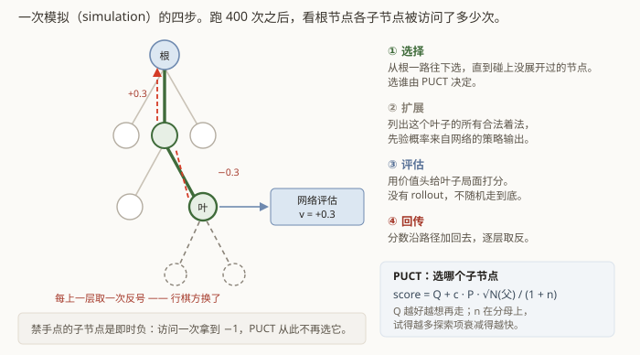
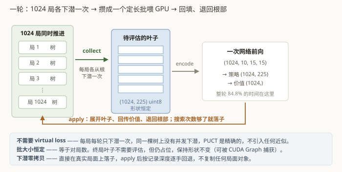

# 第 6 章　自博弈与 MCTS

这一章从零讲起，不假设你了解强化学习。它也是整份报告里最长的一章 ——
如果只能读一章，读这章。

## 6.1 先回答那个显然的疑问

一个随机初始化的网络完全不会下棋。让两个不会下棋的东西互相对弈，产生的是两坨垃圾棋谱。
**用垃圾数据训练，怎么可能变强？**

答案的关键在于：**训练目标不是"模仿自己"，而是"模仿一个比自己强的东西"。**

那个更强的东西是**网络 + 搜索**。搜索会拿网络当直觉，往下试探几百步，然后给出一个
比网络原始直觉更好的落子分布。网络去拟合这个更好的分布，于是变强一点。
网络强一点，搜索的起点就好一点，搜索的结果又更好一点……

这个循环叫**策略提升**（policy improvement）。它能启动，靠的是**规则本身提供了
一个绝对正确的信号**：谁连成五个谁赢。哪怕两边都在乱下，"最后谁赢了"这个事实是真的。
从这一个真信号出发，价值头先学会粗糙的判断，搜索借它做出略好的选择，
整个东西就滚起来了。

**零棋谱**这条约束因此是可行的：知识不来自人类，来自"规则 + 大量试错"。

## 6.2 网络输出的两样东西

抛开第 4 章那些辅助头，核心只有两个输出：

- **策略（policy）**：一个长度 225 的概率分布，"这 225 个点里，各自有多大可能是好棋"。
- **价值（value）**：一个 `[-1, 1]` 的标量，"**站在当前该走棋的一方**看，这局最后是赢是输"。
  `+1` = 必胜，`-1` = 必败，`0` = 势均力敌。

价值的视角是**行棋方**，这一点必须钉死。行棋方每走一手就换人，所以同一个局面在父子
节点之间价值要**取反**。这里含糊一点，符号就反了，训练出来的东西会拼命往自己输的方向走。
代码里 `Position::to_move()` 的语义被定义成"**下一手轮到谁**"，无论是否终局都切换，
就是为了让这件事没有歧义。

## 6.3 MCTS：让网络「想一想」

蒙特卡洛树搜索的直觉很朴素：**多试几种走法，看看哪种结果好。**

难点在于试探的分支是指数爆炸的。MCTS 的办法是**不均匀地试** —— 把绝大部分试探花在
看起来有希望的着法上，同时留一点力气去碰没试过的。

每一次"想一想"叫一次**模拟**（simulation），分四步：



**① 选择（Select）**：从根节点出发，一路往下选子节点，直到走到一个还没展开过的节点。
每一步选谁，由 PUCT 公式决定（下面细讲）。

**② 扩展（Expand）**：把这个叶子节点展开 —— 列出它的所有合法着法，
每个着法的初始"先验概率"来自网络的策略输出。

**③ 评估（Evaluate）**：用网络的价值头给这个叶子局面打个分。
（很多经典 MCTS 在这里是随机走到底看谁赢，叫 rollout；AlphaZero 类方法用网络代替，
**本项目也没有 rollout**。）

**④ 回传（Backup）**：把这个分数沿着刚才走过的路径一路加回去，
每往上一层**取一次反号**（因为行棋方换了）。

跑够 `sims` 次（默认 400 次）之后，看根节点每个子节点被访问了多少次 ——
**访问次数最多的那个着法，就是搜索的结论**。

### PUCT：在「已知的好」和「没试过的」之间怎么权衡

第 ① 步选子节点时，对每个候选着法算一个分数，取最高的：

```
score(a) = Q(a) + U(a)

Q(a) = 这个着法试过的所有结果的平均分     ← 利用（exploit）
U(a) = c_puct · P(a) · √N(父) / (1 + n(a)) ← 探索（explore）
```

逐项解释：

| 记号 | 含义 |
|---|---|
| `Q(a)` | 走 `a` 之后的平均评估。试出来越好，越想再走 |
| `P(a)` | 网络给 `a` 的先验概率。网络越看好，越值得试 |
| `n(a)` | `a` 已经被访问了几次。**在分母上** —— 试得越多，探索项越小 |
| `N(父)` | 父节点总访问次数。**在分子上**（开根号）—— 总预算越多，越舍得分一点给冷门着法 |
| `c_puct` | 探索强度，默认 1.6 |

直觉：一开始所有 `n(a)` 都是 0，`U` 完全由网络的先验主导，搜索按直觉走；
随着某个着法被反复访问，它的 `U` 迅速衰减，搜索被推去试别的。**这就是"想一想"
的全部机制** —— 没有别的魔法。

本项目在标准公式上做了两处常见增强：

**c_puct 随访问数增长**：
```
c_puct(N) = c_puct + log((N + c_puct_base + 1) / c_puct_base)
```
访问数越多，探索系数略微增大。这是 AlphaZero 论文里的变体，让搜索在预算大时
不会过早收敛到一条线上。

**FPU（first play urgency）**：还没访问过的子节点，`Q` 用什么？如果用 0，
在一个已经确认很好的局面里（`Q ≈ +0.9`），任何没试过的着法都会显得"比现状差"，
搜索就懒得试了；反过来在劣势局面里又会把所有没试过的着法都试一遍。
本项目用的是：

```
fpu = 父节点的 Q − fpu_reduction × √(已探索着法的先验之和)
```

即"未访问着法的预估值 = 当前局面评估，再打一点折扣，折扣随已经探索的比例增大"。
默认 `fpu_reduction = 0.25`。

### 为什么训练目标是「访问次数」而不是「最优着法」

搜索完可以直接取访问最多的那一手，让网络去拟合这个 one-hot 标签。但实际用的是
**整个访问分布**（归一化成概率）。

原因：访问分布携带的信息多得多。"A 走了 200 次、B 走了 190 次、C 走了 5 次"和
"A 走了 390 次、B 走了 5 次、C 走了 5 次"，最优手都是 A，但前者告诉网络"B 也几乎一样好"，
后者告诉它"只有 A 行"。用 one-hot 会把这层信息全扔掉。

第 12 章会回到这个选择上 —— 它也是那个否定性结论的核心。

## 6.4 自博弈循环

有了搜索，数据是这么产生的：

```
开一局 → 每一手都跑一次 MCTS → 按访问分布落子 → 记下 (局面, 访问分布)
      → 一直下到终局 → 把胜负结果回填给这局的每个局面
      → 得到一批 (局面, 策略目标, 价值目标)
```

几个必要的调料：

**Dirichlet 噪声**（`dirichlet_alpha=0.15`, `dirichlet_eps=0.25`）：
在**根节点**的先验上加一点随机扰动。如果不加，网络说哪好就只搜哪，
永远发现不了自己没想到的着法，整个训练会卡在局部最优里。只加在根节点，
是因为只有根节点的选择会真正变成训练数据。

**温度**（前 16 手 `temperature=1.0`，之后趋近 0）：
落子时按访问分布**采样**而不是取最大。开局阶段多样性很重要 ——
不然一千局自博弈会下出一千盘一模一样的棋。中局之后切换成确定性，保证棋局质量。

**Playout cap randomization**（`sims=400` / `fast_sims=100` / `full_search_prob=0.25`）：
只有 25% 的手用完整的 400 次模拟，其余用 100 次快速搜索，且**只有完整搜索的那些手
才产生训练样本**。这是个很划算的技巧：训练目标的质量取决于搜索深度，
但推进棋局并不需要每手都想那么久。平均下来每手约 175 次评估，
却拿到了 400 次质量的训练数据。

**部署分布自博弈**（`deployment_distribution_fraction=0.25`）：
25% 的对局，**落子由零搜索策略直接决定**（就是部署时的那个 argmax），
但训练目标仍由 MCTS 生成。

这一条是为第 1 章那条约束专门加的。如果所有训练数据都来自"MCTS 落子"的对局，
那网络见到的局面分布就是"MCTS 会走进的局面"；而部署时它自己走，会走进另一批局面 ——
典型的训练/部署分布漂移。让四分之一的对局按部署方式走，就把那批局面也纳入了训练。

## 6.5 一个意料之外的发现

写测试时加了一条断言：「随机自博弈中，黑方应该会踩到禁手点」。结果**恒为 0**。

排查后发现不是 bug，而是：**MCTS 自己就把禁手点规避掉了。**

道理很简单 —— 禁手点的子节点是**即时负**，搜索访问它一次拿到 `-1`，
`Q` 立刻变得极差，PUCT 从此再也不选它。这件事**不需要网络懂任何东西**，
哪怕先验是完全均匀的、网络刚随机初始化，搜索也会自动避开。

而这正是我们希望蒸馏进策略网络的行为：访问分布里禁手点的概率接近 0，
网络照着学就行了。

于是那条测试被拆成两条：

- 带搜索时，禁手告负率必须很低（< 5%）—— 验证搜索确实在规避；
- 把搜索摘掉、纯随机落子时，禁手告负率必须 > 0 —— 验证"禁手点仍是合法落子、
  落上去立即判负"这条语义真的接在 runner 里。

只看其中任何一条，都会得出错误结论。**一条测试通过，不代表它测的是你以为的东西。**

## 6.6 上千局怎么并行

到这里都是算法。剩下的是工程 —— 而工程决定了这个项目能不能在一天内跑完。

朴素做法是"一个进程跑一局"，开几百个进程。问题是每次网络评估都是一个 batch=1 的
GPU 调用，GPU 利用率惨不忍睹。

实际做法是**把上千局的搜索交错起来**，凑成大批次：



```python
runner.collect(boards, to_move, history, move_number, needs_eval)
policy, value = evaluator(boards, to_move, history, move_number)  # 一次 GPU 前向
runner.apply(policy, value)
```

- **collect**：C++ 侧让**每一局各自从根下潜一次**，停在叶子上，把待评估的局面写进
  输出缓冲区。
- **中间**：Python 侧编码特征，跑**一次**网络前向，得到整批的策略和价值。
- **apply**：C++ 侧用先验展开各自的叶子、回传价值、退回根部。某一局搜索次数够了，
  就落子、开始下一手；下完了就存样本、开新的一局。

这个安排带来三个直接好处：

**① 不需要 virtual loss。** 常规的并行 MCTS 会在同一棵树上同时下潜多条路径，
为了避免它们全都挤到同一个分支，要加一种叫 virtual loss 的临时惩罚 —— 这是个**近似**。
这里每局每轮只下潜一次，同一棵树上根本不存在并发下潜，
**PUCT 是精确的**，一点近似都不用引入。

**② 批大小恒定。** 批大小恒等于同时推进的对局数，GPU 每轮拿到的都是同一形状的定长批。
形状不变意味着可以直接被 CUDA Graph 捕获（本项目还没做，见第 12 章的未竟事项）。
终局叶子不需要评估，但**仍然占位**，就是为了保持形状不变。

**③ 下潜零拷贝。** 下潜时直接在真实的 `Position` 上落子，`apply` 之后按记录的深度
逐手回退，全程不复制任何局面对象。

还有两条实现约定：

- **线程之间零共享**。每局的统计量和产出样本都存在各自的槽位里，工作线程互不接触，
  汇总只在主线程做，全程无锁。
- **特征编码只写一遍**，留在 Python 侧（第 3 章）。C++ 只吐原始数据。
  编码规范因此只有一份，不会出现两边悄悄走样。

## 6.7 实测

15×15，1024 局并行，36 个搜索线程，sims 400/100、完整搜索比例 0.25
（平均 175 次评估/手），单卡：

| 指标 | 数值 |
|---|---|
| 网络评估 | 41,905 局面/s |
| 落子 | 239.5 手/s |
| 完成对局 | 2.76 局/s（平均 87 手/局） |
| 训练样本 | 40.5 条/s |
| GPU 前向占比 | 84.8% |

### 顺带一个指标陷阱

上千局同时推进时，**单局要跑很久才结束**：1024 局并行、总计 240 手/秒，
摊到单局只有 0.23 手/秒 —— 一局三十多手要两分多钟。

于是"局/秒"这个指标在测量时长不够时会严重失真（一次 90 秒的测量只跑完 1 局）。
基准脚本因此以**手/秒**为主指标，局产量由"手/秒 ÷ 平均每局手数"推算，
并在完成局数不足时明确标出不可信。

这是第 9 章那类问题的预演：**指标本身可以骗人**。

## 6.8 对战时的搜索：一轮取多个叶子

自博弈里每局每轮只下潜一次 —— 同一棵树上不存在并发下潜，所以可以做**精确的
PUCT**，不需要 virtual loss。批是靠"同时推进 2048 局"填起来的。

**对战时这条前提不成立**：只有一个局面。一轮只产一个叶子，GPU 每次只算一个
15×15 的输入。实测（4.44M 参数、20 个 block）：

| 批大小 | 一次往返 | 每个局面 |
|---|---|---|
| 1 | 11.54 ms | 11.545 ms |
| 16 | 12.19 ms | 0.762 ms |
| 64 | 12.91 ms | 0.202 ms |
| 256 | 24.98 ms | 0.098 ms |

**批 1 和批 64 的一次往返几乎一样贵。** 那 12 毫秒绝大部分不是在算，
是 kernel 启动开销与显存往返 —— 和第 10 章那个 70 倍的坑同一个成因。
于是单局面搜索的 GPU 利用率只有约 1.7%，CPU 树只占 0.7%，其余全在等。

修法是 **virtual loss**：从同一棵树连续下潜多次，每次给走过的路径记一笔
虚拟败绩（按一次失败计入统计），逼下一次岔开，攒够一批再一起送 GPU。
回传时沿同一条路径把它减回去。

省的是**往返次数**，不是计算量：64 次模拟从 64 轮压到 4 轮，实测 728 ms → 132 ms。

### 换算成棋力

快不等于强 —— 批量收集是**近似**，后取的叶子看到的是带虚拟败绩的过时统计，
所以每次模拟的价值会下降。"模拟数涨 12 倍"和"每次模拟变差"是往相反方向拉的，
谁赢只能靠对局定。同样墙钟预算下直接对打（各 200 局）：

```
批量 800 次模拟（leaves=16，约 0.73 秒/手）
  vs 逐叶 64 次模拟（原来同样 0.73 秒/手）
  143 胜 57 负 0 和    得分率 71.5%    Elo +160
```

高出 50% 约 **6.1 个标准差**。净收益远大于近似带来的损失。

### 三条纪律

1. **自博弈那条路径一行没改。** `descend()` 与不带 `clear_virtual` 的
   `backup_terminal()` 保持原样；虚拟计数全为 0 时 `select_child` 的算术
   与改动前**逐位相同**（整数加 0、浮点减 0.0f 都是精确的）。
   有快照测试钉着 —— 包括自博弈产出样本的哈希。
2. **评测口径不变。** 竞技场与 `search_gap.py` 仍用 `leaves=1`，
   报告里的每一个数字都要保持可复算。
3. **leaves 必须远小于 sims。** 一轮取 N 个叶子就有 N 条路径是硬岔开的，
   轮数太少搜索会退化成宽度优先 —— 实测 sims=64、leaves=16 时根节点访问
   从 55:1:1:1 摊成 13:10:9:8：快了，但**搜的东西不一样了，而且不报任何错**。
   部署侧按 `sims // 8` 钳住，保证至少 8 轮。

### 两个反直觉的地方

**多线程没用。** 搜索线程池并行的维度是**槽位**（同时搜几个不同局面），
对战只有一个局面。实测 256 次模拟：1 线程 344 ms、16 线程 370 ms、64 线程 377 ms，
**越多越慢**。一轮内部的多次下潜也没法并行 —— 每次都要看上一次留下的虚拟败绩。
并行完全发生在 GPU 的批维度上。

**判重必须在计数之前。** 树还没长开时一轮会连着下潜两次落到同一个叶子。
第一版把它记下来又丢弃，结果同样的 sims 下批量比逐叶**少算一次模拟**
（47 对 46，被 `总访问数必须等于 sims` 那条测试抓到）。丢弃时还得把那次的
虚拟败绩撤掉，否则泄漏 —— 而泄漏只会让搜索一直绕开某条路径，不报任何错。

---

## 代码索引

| 文件 | 符号 | 作用 |
|---|---|---|
| `csrc/mcts.h` | `MctsTree` | 单局 PUCT 搜索树，扁平数组存储 |
| `csrc/mcts.cpp` | `select_child` | PUCT 公式（含 c_puct 增长与 FPU） |
| `csrc/mcts.cpp` | `descend_with_virtual_loss` | 对战时一轮多叶的下潜；`descend` 保持原样 |
| `csrc/search.cpp` | `BatchSearcher::collect` | 一轮收集多个叶子，判重与虚拟败绩的撤销都在这 |
| `tests/test_batch_search.py` | `test_selfplay_path_matches_pre_change_snapshot` | 钉住自博弈逐位不变 |
| `csrc/mcts.h` | `MctsConfig` | `c_puct=1.6`、`fpu_reduction=0.25` 等 |
| `csrc/selfplay.h` | `SelfPlayRunner` | 向量化自博弈：collect / apply 协议 |
| `csrc/selfplay.h` | `SelfPlayConfig` | sims、温度、Dirichlet、部署分布比例 |
| `csrc/position.h` | `to_move` | 语义定为"下一手轮到谁"，消除价值视角歧义 |
| `gomoku_instinct/selfplay/actor.py` | `SelfPlayActor` | 把 C++ runner 与 GPU 网络接起来 |
| `gomoku_instinct/selfplay/actor.py` | `ModelEvaluator` | 编码特征 + 一次前向 |
| `tests/test_selfplay.py` | `test_mcts_avoids_forbidden_points` | 带搜索时禁手告负率必须很低 |
| `tests/test_selfplay.py` | `test_random_play_does_hit_forbidden_points` | 摘掉搜索后必须 > 0，否则语义没接上 |
| `tests/test_selfplay.py` | `test_rng_state_roundtrip_is_exact` | 换机续训后随机流逐位一致 |
| `scripts/bench_selfplay.py` | `main` | 端到端吞吐基准 |

上一章：[BF16 与 Kahan](05-bf16-optimizer.md)　　下一章：[训练循环](07-training-loop.md)
