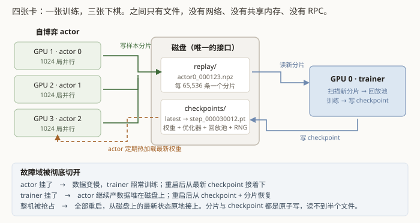

# 第 8 章　多卡编排与容灾

这一章讲怎么把训练真正跑起来，以及怎么保证它**断了能接上**。

后面这件事不是锦上添花。开发机有使用时长限制、随时可能被收走或换机器，
所以"能中断、能续训"是**功能需求**，不是运维优化。

## 8.1 一张卡训练，三张卡下棋

第 6 章测过：一张卡跑自博弈，每秒能产出 40.5 条训练样本。而训练侧一步吃掉
1024 条样本 —— 按目标复用比 4.0 算，每秒需要约 250 条新样本。

**一张卡产数据，喂不饱一张卡训练。** 所以四张卡的分工是：

```
GPU 0 ── trainer  ── 训练、写 checkpoint
GPU 1 ── actor 0 ─┐
GPU 2 ── actor 1 ─┼─ 自博弈，写样本分片
GPU 3 ── actor 2 ─┘
```

三个 actor 各自独占一张卡，独立跑自博弈。

## 8.2 只通过文件系统耦合



actor 和 trainer 之间**没有网络通信、没有共享内存、没有 RPC**，只有文件：

- **actor 定期热加载 `checkpoints/latest`**，用最新权重继续自博弈；
- **actor 把样本写成分片文件**（`actor0_000123.npz` 这样）；
- **trainer 扫描目录，把没见过的分片吃进回放池**。

这个设计的好处是**故障域被彻底切开**：

| 谁挂了 | 后果 |
|---|---|
| 某个 actor | 数据产出变慢，trainer 照常训练。重启后从最新 checkpoint 接着下 |
| trainer | actor 继续产数据堆在磁盘上。重启后从 checkpoint + 分片恢复 |
| 整机被抢占 | 全部重启，从磁盘上的最新状态原地接上 |

代价是耦合松、延迟高（actor 用的权重总是滞后几分钟）。对自博弈来说这完全可以接受 ——
反正回放池里本来就混着过去几十万步产生的数据。

### 原子写

分片和 checkpoint 都是**先写 `.tmp`，再 `os.replace()` 原子替换**。

原因很实际：如果 trainer 正在读一个 actor 写到一半的文件，会读到截断的数据 ——
可能报错，也可能**恰好解析成一批垃圾样本**。后者更可怕。

`latest` 这个指针文件同样是原子更新的，保证读到的永远是一个完整存在的 checkpoint 名。

## 8.3 保存的不只是权重

"续训"这个词很容易被低估。只存权重的话，重启后：

- 优化器的一阶/二阶矩清零 → 前几百步的更新方向是乱的；
- 学习率调度重新从 warmup 开始 → 又冲一次大学习率；
- 随机数流重来 → 自博弈的探索序列和之前撞车；
- 回放池是空的 → 要重新攒 5 万条才能开训。

所以 checkpoint 里存的是**整套训练状态**：

| 存了什么 | 为什么 |
|---|---|
| `step` / `cycle` / `samples_seen` | 学习率调度、复用比统计的依据 |
| 模型权重 | |
| 优化器状态 | 含 **Kahan 补偿缓冲区**（第 5 章）——它丢了，累积的残差就没了 |
| 回放池状态 | 分片游标，重启后知道从哪继续读 |
| `model_cfg` / `trainer_cfg` | 保证加载时结构和配置对得上，不会"权重与结构不匹配"到运行时才炸 |
| RNG 状态 | `torch` / `torch.cuda` / `numpy` / `python` / **自博弈 runner 各自的随机流** |

最后一项值得单说：C++ 侧每局的 RNG 状态用标准库的流序列化完整导出，
换机续训后**随机流逐位一致**。这不是强迫症 —— 没有它，"同种子可复现"就是句空话，
而不可复现的系统排查起 bug 来会加倍痛苦。

测试里逐项比对了恢复后的状态是否与保存时完全一致，包括补偿缓冲区和分片游标。

### 一个只在 GPU 上出现的续训崩溃

这套东西在 CPU 上测得好好的，一上 GPU 就崩。

原因：加载时用了 `map_location="cuda"`，于是**连 RNG 状态那几个 ByteTensor 也被搬上了
GPU**，而 `torch.set_rng_state()` 要求 CPU 张量。

修法是加载一律用 `map_location="cpu"`，需要上卡的再显式搬。同时补了一条 GPU 续训测试 ——
在 CPU 上测过不等于在 GPU 上能跑。

## 8.4 先在小棋盘上跑通全链路

M5 这一步是整个项目里性价比最高的决定。

15×15 的一轮完整训练要按天算；9×9 只要几十分钟。而"数据格式对不对、损失下不下降、
续训接不接得上、指标记录全不全"这些问题**跟棋盘大小无关**。

于是先在 9×9 上端到端跑通，把这类问题在便宜的地方暴露掉。第 7 章那个"样本复用比
飙到 23.8"就是在这一步抓到的 —— 如果拖到 15×15 才发现，代价是几十小时的机器时间。

第 4 章提到策略头是纯卷积的，所以同一份代码不改一行就能跑 9×9。
（那次是重新训练，不是把权重迁移过去。）

## 8.5 编排脚本里的两个实际问题

**其一：容器要按名字管理。** 早期的 `stop` 命令是杀掉 `docker run` 客户端进程 ——
然而**杀掉客户端并不会停掉容器**。一次检查发现机器上跑着 9 个 actor 和 3 个 trainer，
互相抢 GPU。改成给每个容器起名字，用 `docker rm -f <名字>` 停。

**其二：日志必须关掉缓冲。** 长任务的 stdout 重定向到文件时是**块缓冲**的，
几分钟内看不到任何新输出。后果不只是"看着急"——日志是追加写的，
你读到的会是**上一次运行留下的旧行**，足以让人把一次正常的续训误判成失败。
（我本人就因此误杀过一次健康的训练。）

修法是设 `PYTHONUNBUFFERED=1`，并在每次启动时往日志里写一行带 pid 的分隔线。

这两条都属于第 11 章那一类：**不报错，只是让你看到错误的东西**。

---

## 代码索引

| 文件 | 符号 | 作用 |
|---|---|---|
| `scripts/launch_training.sh` | `stop_all` | 按容器名停 —— 杀 docker 客户端并不会停掉容器 |
| `scripts/actor.py` | `main` | 独立自博弈进程：热加载 latest、原子写分片 |
| `scripts/train.py` | `main` | 训练入口，默认自动续训 |
| `gomoku_instinct/train/trainer.py` | `save_checkpoint` | 整套状态 + 原子替换 |
| `gomoku_instinct/train/trainer.py` | `resume_or_start` | 启动时自动找最新 checkpoint |
| `gomoku_instinct/train/replay.py` | `ingest_new_shards` | 扫描并吃进 actor 写的新分片 |
| `gomoku_instinct/train/replay.py` | `resume_shard_index` | 重启后分片编号接着写，不从 0 重来 |
| `scripts/docker_run.sh` | `PYTHONUNBUFFERED` | 关掉 stdout 块缓冲 |
| `tests/test_train.py` | `test_checkpoint_restores_full_training_state` | 逐项比对恢复后的状态 |
| `tests/test_train.py` | `test_checkpoint_roundtrip_on_gpu` | 8.3 末尾那个只在 GPU 上出现的崩溃 |

上一章：[训练循环](07-training-loop.md)　　下一章：[怎么知道它真的变强了](09-measuring-strength.md)
