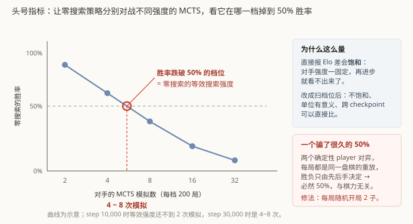

# 第 9 章　怎么知道它真的变强了

这一章讲评测。它比听起来重要得多 —— **一个骗人的指标会让你朝错误的方向优化好几天。**
这个项目在这上面栽了三次。

## 9.1 为什么「loss 在降」什么都不说明

策略损失在降，只说明网络越来越会拟合 MCTS 的访问分布。它不说明：

- 网络下棋是不是变强了（拟合得更准 ≠ 下得更好，第 12 章的主题）；
- 是不是在过拟合一小撮反复复用的旧数据（第 7 章那个复用比 23.8）；
- **MCTS 本身有没有变强**——目标在动，损失值不可比。

最后一点尤其阴险：自博弈项目里，训练目标是自己产生的。网络变强 → MCTS 变强 →
目标分布变得更尖锐、更难拟合 → **损失可能反而上升**。绝对损失值在这种设置下
几乎没有意义。

所以必须直接下棋。

## 9.2 竞技场：让两个版本真的对局

`gomoku_instinct/eval/arena.py` 做批量对局并估 Elo。三条约定：

**① 一律以零搜索模式参赛。** 用 MCTS 模式评测晋级，会优化错目标 ——
你会选出"配合搜索最好用"的权重，而不是"自己最会下"的权重。评测条件必须和部署条件一致。

**② 先后手逐局强制轮换。** 连珠的黑白规则不对称（黑方有禁手），先手和后手的胜率
本来就不一样。不轮换的话，"A 胜 B 60%"里有多少是棋力、多少是先手优势，分不开。

**③ 对手包括规则基线。** 模型之间互相比只能给出**相对**强弱；随着两边一起变强，
"新版本比旧版本强 50 Elo"这句话的绝对含义会漂移。所以固定两个不学习的对手：

| 基线 | 是什么 |
|---|---|
| `RandomPlayer` | 在空点里随机落子 |
| `GreedyThreatPlayer` | 纯规则：能成五就成五，对手能成五就挡，否则按棋型评分选最凶的一手。**不是 AI**，只是一把尺 |

## 9.3 头号指标是怎么迭代出来的

真正想量的东西是第 1 章那条命题：**零搜索的网络，离带搜索的自己有多远。**

### 第一版：直接算 Elo 差

拿零搜索的自己去打带 MCTS 的自己，算 Elo 差。

**问题：它会饱和。** 训练早期零搜索被搜索版本打得很惨，Elo 差是个大负数；随着训练推进，
差距缩小，但一旦对手的搜索强度固定，这个数就会趋于一个平台，之后再进步也看不出来。

### 一个更尴尬的问题：确定性重放

改进过程中发现了一件事：某次测量结果稳定在 **50%**，怎么调都是 50%。

原因是**两个确定性 player 对弈，每一局都是同一盘棋的完整重放**。
温度为 0 的零搜索是确定性的；固定种子的 MCTS 也基本是确定性的。于是 200 局对局
其实只有 2 盘不同的棋（先手一盘、后手一盘），胜负完全由先后手决定，
**统计出来必然是 50%**，跟棋力毫无关系。

这个 bug 的可怕之处：**结果看起来非常合理**。50% 像是"两者旗鼓相当"的正常结论。

修法是**每局随机开局若干子**（`random_opening_plies=2`），强行把对局打散。

### 最终版：「零搜索值多少次模拟」

不再报一个 Elo 差，而是**扫一遍搜索强度**：让零搜索策略分别对战 2、4、8、16、32 次
模拟的 MCTS，每档跑 200 局，看它在哪一档掉到 50% 胜率。



结论读起来是这样：**"当前的零搜索策略，大致相当于 N 次模拟的 MCTS。"**

这个口径的好处：

- **不会饱和** —— 网络变强，等效模拟数就往上走，永远有分辨力；
- **单位有意义** —— "值多少次模拟"直接对应第 1 章那条命题；
- **可比** —— 不同 checkpoint 之间的数字可以直接放在一起看。

作为参照：step 10,000 时这个数还不到 2 次模拟，step 30,000 时是 4~8 次。

## 9.4 一个一直在误导我的指标

前面说过绝对损失值不可比，因为目标在动。那怎么衡量"网络拟合得多准"？

答案是**减掉目标分布自身的熵**：

```
超出量 = 策略交叉熵 − 目标分布的熵
```

信息论上，用分布 `q` 去编码来自分布 `p` 的样本，交叉熵 `H(p,q) = H(p) + KL(p‖q)`。
其中 `H(p)` 是目标本身的不确定性 —— 那是**不可能消除的**下界；`KL(p‖q)` 才是
"网络离目标还有多远"。

所以超出量 = KL 散度 = 真正的拟合误差，**它与目标分布的形状无关，可以跨时间比较**。

这个量一直被记录着（`loss/policy` 减 `policy/target_entropy`），但我卡了一万多步
才想起来看它。之前一直在盯绝对损失，而绝对损失分不开两种截然相反的情况：

> **"指标不动"可能是学不动，也可能是已经学完了。**

绝对损失分不开这两者，减掉目标熵才分得开。第 12 章正是靠这个量才得出结论的。

## 9.5 又一个分母问题

第 7 章讲过禁手指标的故事，这里再点一次，因为它是同一类错误的第二次出现：

- 无条件的"禁手 argmax 率" = 0.4%，看起来很好；
- 但绝大多数局面根本没有禁手点，它们把分母撑大了；
- 只在"确实存在禁手点"的局面上统计，真实数字是**另一个量级**。

**指标的分母决定了它能不能骗你。** 每定义一个比率，都要问一句：
分母里有多少个样本是"不可能出错"的？

## 9.6 最终结果

零搜索策略（单次前向 + argmax）的实测棋力：

| 对手 | 结果 |
|---|---|
| 随机落子 | 400 胜 0 负（Elo +1161），执黑执白各 200 局全胜，0 次禁手告负 |
| 规则基线（贪心威胁） | 199 胜 1 负（得分率 99.5%，Elo +920） |
| 同权重 MCTS | 约相当于 **不到 2 次模拟** |

前两行说明它确实学会下棋了 —— 不是随机乱走，也不是只会照着规则贪心。
第三行说明它**不强**：个位数次模拟是个极低的搜索强度，任何正经引擎都会碾压它。

第三行也是这个项目没有解决的核心问题，下面两章讲为什么。

---

## 代码索引

| 文件 | 符号 | 作用 |
|---|---|---|
| `gomoku_instinct/eval/arena.py` | `play_match` | 批量对局，先后手逐局轮换 |
| `gomoku_instinct/eval/arena.py` | `elo_from_score` | 得分率 → Elo 差 |
| `gomoku_instinct/eval/baselines.py` | `GreedyThreatPlayer` | 纯规则基线，提供绝对标尺 |
| `gomoku_instinct/eval/mcts_player.py` | `MctsPlayer` | 带搜索的对手 |
| `csrc/search.h` | `BatchSearcher` | 对指定局面批量搜索；按**完整着法序列**载入，否则历史平面全空 |
| `scripts/search_gap.py` | `main` | 头号指标：扫模拟数档位 |
| `gomoku_instinct/train/losses.py` | `compute_losses` | 导出 `policy/target_entropy` 指标，即超出量的减数 |

上一章：[多卡编排与容灾](08-orchestration.md)　　下一章：[零搜索部署](10-zero-search-deployment.md)
