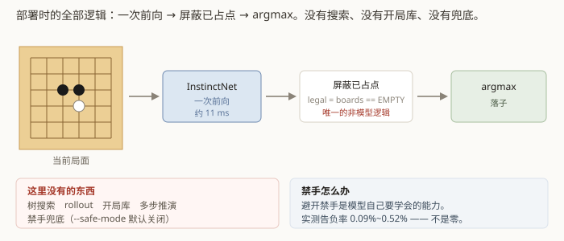

# 第 10 章　零搜索部署

前面九章的一切，最后收敛到三行代码。

## 10.1 落子的全部逻辑



```python
legal  = boards == EMPTY                                # 只屏蔽已占点
logits = out.policy.float().masked_fill(~legal, -inf)
move   = int(torch.argmax(logits, dim=-1).item())       # temperature = 0
```

就这些。**没有树搜索、没有 rollout、没有开局库、没有多步推演**，
也没有"如果模型想走禁手就换一个"这类兜底。`analyze()` 返回什么，`game.play()` 就落什么。

网页版与竞技场评测**共用同一个 `InstinctPlayer`**，一字不差 —— 所以「页面上跟你下棋的」和「评测里报出那些胜率的」是同一套落子逻辑，逐手一致。

## 10.2 唯一的非模型逻辑

`legal = boards == EMPTY` 这一行是规则逻辑，不是模型给的。它只做一件事：
不让模型往已经有子的地方落。

**这是必要的**——否则模型选中占用点时程序会直接报错，游戏进行不下去。

但它不带任何战术信息：它不知道谁有活三、不知道哪里是禁手，只知道"这格有子了"。
严格讲它确实是模型之外的逻辑，所以要说清楚，不含糊过去。

## 10.3 禁手兜底默认关闭

代码里有个 `--safe-mode`，开启后会用规则把禁手点也屏蔽掉。**它默认关闭。**

理由在第 1 章讲过：严格 RIF 语义下禁手点是合法落子，避开它是模型必须自己学会的能力。
替它挡掉等于在推理时偷偷加了规则外挂 —— 而外挂正是"零搜索"这条约束要排除的东西。

代价是真的会犯规。自博弈实测最终约 **0.84%**（训练早期一度到 6%）。不过那是**带搜索
和温度采样**的自博弈；纯零搜索的竞技场对局共 600 局，禁手告负 **0 次**。
**当人执白、AI 执黑时，它踩到禁手就是真的判负。**

模型自己也有一个禁手点预测头（第 4 章），但那个输出**只用于显示**，
从不参与选点，网页版甚至根本没把它发到前端。

## 10.4 对战界面

**网页版**（`gomoku-instinct serve`）画的是真棋盘：鼠标悬停时先显示半透明的棋子，
确认了再点；AI 每落一手会标出它给这一手的概率，以及**所有概率不低于阈值的其它候选点**
（阈值在页面上可调，默认 5%）。

后面这个信息很有意思 —— 同一个模型，有时是「58.6% 对 21.6%」（很笃定），
有时七八个点挤在 5%~7% 之间（几乎在一堆等价点里随便挑）。这是零搜索模型的真实状态，
带搜索的引擎不会给你看到这个。

阈值筛选放在浏览器一侧，服务端一次就把前 100 个候选发过去。100 这个数不是随手定的：
阈值最低可调到 1%，而概率大于 1% 的点最多 99 个，**所以任何允许的阈值都不会因为服务端
截断而漏掉候选**。这是本项目一条反复出现的原则：宁可多发一点，也不要做"取前 N 个"
式的静默截断 —— 截断了却不说，看到的人会以为模型只考虑了这几个点。

`--ckpt` 可以给多次，页面上就能在多个模型之间切换，而且**用哪个模型是每局各自的事**：
开两个标签页就能让两个版本同时各下各的，拿同一个局面直接对比。这一点最早不是这么做的，
代价见第 11 章 #17。

### 观战：让两个版本互相下

页面上还有一个**观战模式** —— 黑白各选一个模型（**可以选同一个**），让它们自己下完一整局，
每落一手停几秒方便看清楚。停顿时长在页面上可调，也可以切成**手动逐手**，一手一点。

这个功能的实用价值在于它能看到竞技场胜率看不到的东西：胜率只告诉你 A 比 B 强多少，
观战能看出**强在哪一手**。同一个模型左右互搏尤其有意思 —— 双方的先验完全一致，
分出胜负靠的纯粹是先手与局面本身。

**开局必须随机落几子，否则每一局都是同一盘棋的重放。** 零搜索落子是 argmax、
temperature = 0，是个确定性函数：同一个模型看到同一个局面必然给出同一手，
空盘开局只有唯一一条棋路。这一层最早漏掉了，实际表现就是"重开一百局，一百盘一样"。
竞技场早就踩过同一个坑，而且当时更隐蔽（第 11 章 #12：头号指标恒为 50%）——
那边的解法是 `play_match(random_opening_plies=2)`，观战用同一套机制、同一个默认值。

随机是**在全部合法点上均匀取**，故意不带任何棋理 ——
否则就是在用人的开局偏好替模型做选择。这几颗子在棋盘上会打叉标出来：
不标的话，你会对着一手随机落子琢磨"它为什么下这里"。
手数可调到 0，那就是每次都下同一盘 —— 想反复看同一条棋路时，确定性正是要的。

服务端只提供一条「走一手」的接口，**节奏全部在浏览器一侧**：
自动模式是"走一手 → 等 N 秒 → 再走一手"，手动模式是"等按钮"，
两者共用同一条接口。服务端因此没有定时器、没有后台任务，
也不会出现"页面关了棋还在自己下"。开局**不自动落第一手**，第一手也要看得见。

人机模式下的落子路径不需要为此加任何分支：棋盘能不能点判的是
`轮到谁 === 人类执哪色`，而观战局里"人类执哪色"是 0（谁都不是），
这个条件恒为假，棋盘自然就是只读的。

服务端只用标准库的 `http.server`，没有引入任何 Web 框架 ——
这个项目至今没有 torch 之外的运行时依赖。

## 10.5 落子要多久

单次前向，GPU 上约 **11 毫秒**。作为对比，MCTS 每手要跑几百次前向。

网页版的端到端延迟约 23 毫秒（含 HTTP 往返和一次全盘禁手判定）。

### 一个 70 倍的性能坑

网页版第一版上线，一次落子要 **810 毫秒**。而单次前向明明只要 11 毫秒。

逐层量下来：

| 同一次前向跑在哪 | 耗时 |
|---|---|
| 主线程 | 11 ms |
| 一条复用的工作线程 | 141 ms |
| 每次新建的线程 | **800 ms** |

原因：`ThreadingHTTPServer` **每个连接开一条新线程**，而 cuBLAS / cuDNN 的句柄是
**按线程**创建的 —— 每落一子都在重建句柄。

修法是把推理统一赶到**一条长期存活、启动时预热过的线程**上
（`ThreadPoolExecutor(max_workers=1)`），落子回到 23 毫秒。

这个坑的形状和第 11 章那一整章一样：**不报任何错，只是慢，而且慢得像"模型就这么大
开销"，很容易被当成理所当然接受。** 排查时还走过两条错路 —— 先怀疑是 torch 开满
144 个 OpenMP 线程自旋抢 CPU（改线程数完全无效），又怀疑是 HTTP 层
（最小 `http.server` 对照只要 0.4 毫秒，排除）。每一步都是量出来的，不是猜出来的。

---

## 代码索引

| 文件 | 符号 | 作用 |
|---|---|---|
| `gomoku_instinct/cli/engine.py` | `InstinctPlayer` | **零搜索约束的落地点**，网页版与竞技场共用 |
| `gomoku_instinct/cli/engine.py` | `MoveAnalysis` | 一次落子决策的全部依据 |
| `gomoku_instinct/model/features.py` | `legal_mask` | 那一行唯一的非模型逻辑 |
| `gomoku_instinct/web/server.py` | `App` | 网页版服务端；推理固定在一条预热线程上 |
| `gomoku_instinct/web/server.py` | `warmup` | 启动时先跑一次，把 cuBLAS 句柄建好 |
| `tests/test_web_server.py` | `test_inference_stays_on_one_dedicated_thread` | 挡住 70 倍那个坑复发 |

上一章：[怎么知道它真的变强了](09-measuring-strength.md)　　下一章：[静默失败图鉴](11-silent-failures.md)
