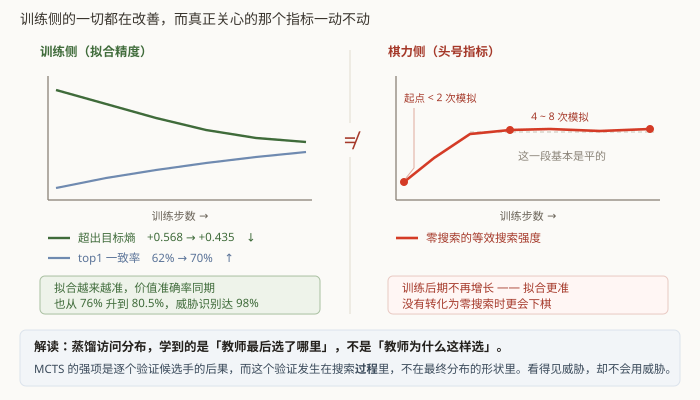

# 第 12 章　一个否定性结论

这一章讲这个项目**没有做成**的事，以及从中确认的一件比"做成了"更有价值的东西。

## 12.1 卡住的地方

回到第 1 章那条命题：把搜索的能力压进权重。

第 9 章给出了衡量它的指标。实际情况是：

| step | 零搜索的等效搜索强度 |
|---|---|
| 10,000 | 不到 2 次模拟 |
| 30,000 | 4 ~ 8 次模拟 |

从 2 涨到 4~8，看起来在进步。但训练后期，**这个数字基本不动了**，
而训练侧的一切指标都还在改善。

## 12.2 先排除「优化受限」

一个自然的怀疑是：是不是学习率太大，网络根本没收敛到该到的地方？

于是做了一次专门的实验：收紧学习率调度，让它衰减到很低，看拟合精度还能不能继续改善。

衡量拟合精度用第 9 章那个量 —— **策略交叉熵减去目标分布自身的熵**（超出量），
它等于 KL 散度，与目标分布的形状无关，可以跨时间比较。

**按学习率分箱**统计（这一点很关键，下面 12.5 会说为什么）：

| 学习率区间 | 超出量 |
|---|---|
| 1.9 × 10⁻³ | +0.568 |
| 8.7 ~ 7.1 × 10⁻⁴ | +0.515 |
| 7.1 ~ 5.5 × 10⁻⁴ | +0.503 |
| < 5.5 × 10⁻⁴ | +0.483 |
| 收敛点（约 1 × 10⁻⁴） | +0.435 |

单调下降，每次学习率减半换来 0.01~0.02 nat。**结论是明确的：确实还在收敛，
学习率降下去拟合会更准。**

## 12.3 训练侧全面改善，头号指标不动

同一段训练里：

| 指标 | 起点 | 收敛点 |
|---|---|---|
| 超出目标熵（越小越好） | +0.565 | **+0.438** |
| 策略 top1 与 MCTS 一致率 | 64.5% | **69.2%** |
| 价值准确率 | 77.8% | **79.3%** |
| 威胁识别准确率 | 99.4% | **99.4%**（已饱和） |

（起点/收敛点均取该窗口首尾各 20 条记录的均值，不取单点 —— 单点噪声 sd 约 0.02，
与真实趋势同量级，12.7 节会说明这一点。日志里 step 15,600~15,750 有一个孤立的
"高峰"（top1 冲到 0.778、价值 0.904），150 步后完全回落到 0.630 / 0.770 ——
**那不是峰值，是回放池被掏空**：trainer 在 step 15,588 重启，内存里的回放池归零，
只攒到 51,326 条（容量的 1.25%）就开始训练，于是迅速过拟合那一小撮样本。
详见[附录：训练运行记录](appendix-training-run.md)。采单点必然踩这种坑。）

**而头号指标在同一段训练里基本没动。**

这就是那个否定性结论：

> **把 MCTS 的访问分布拟合得更准，并不转化为零搜索时更会下棋。**

## 12.4 这排除了什么

这个结论的价值在于它**排除**了一大类改进方向。

"加大模型"、"提高教师的搜索次数"、"继续降学习率"—— 这三条听起来都很合理，
但它们的作用机制**本质上都是让拟合更准**。而拟合更准这条路已经走过了：
超出量降了四分之一，头号指标没动。

按这个证据，它们都不会撬动头号指标。这省下了可能是几天的机器时间。

（顺带说明：这不代表"更大的模型没用"。它说的是，在**当前的监督目标**下，
把拟合做得更准这条路已经到头了。换个目标，模型规模可能重新变得重要。）

### 一个必须说清楚的边界：这不等于"训练量没用"

后来用同一套方案重跑了一次，只训练 10,000 步（[附录 B](appendix-second-run.md)）。
两个模型零搜索直接对局 200 局：

| | 战绩 | 得分率 | Elo 差 |
|---|---|---|---|
| renju15b（10,001 步） vs renju15（30,012 步） | 54 胜 146 负 0 和 | 27.0% | **−173** |

**三倍训练量换来的绝对棋力差距是实打实的**，黑白两侧都稳定落后。

所以本章的结论要读准：不动的是**零搜索相对同权重 MCTS 的差距**，
也就是"网络离它自己的老师还差多远"。这个差距不动，说明**搜索能力的蒸馏没有进展**。
但网络本身在变强 —— 它更会识别棋型、更少走出明显的坏手。

一句话：**继续训练确实会变强，只是变强的部分不是"学会前瞻"。**

### 还有一条时间尺度上的修正

renju15b 在 step 10,001 的头号指标是 **&lt; 2 次模拟**，各档得分率与 renju15 在
step 11,662 的读数**每一档都在噪声内吻合**（详见附录 B）。两次独立训练跑到相近步数、
曲线重合 —— 这个指标测的是方案的稳定性质，不是某一次的偶然。这一点此前无法确认，
因为只有一次训练。

但它也说明：从约 1 万步到 3 万步，这个指标**确实从 &lt;2 走到了 4~8**。
本章 12.3 说的"不动"，针对的是那次学习率衰减实验覆盖的窗口（约 1.5 万~3 万步）
**内部**的变化 —— 在那个窗口里，超出量降了四分之一，而头号指标的变化被噪声淹没。
放在更长的跨度上看它是会动的，只是**比训练侧指标慢一个数量级**。

这条修正不改变结论的方向（拟合更准 ≠ 更会下棋），但把它的强度限制住了：
准确的说法不是"完全不动"，而是**"动得远比拟合精度慢，慢到在一次实验的窗口里量不出来"**。

## 12.5 我的解读

蒸馏访问分布，网络学到的是**教师最后选了哪里**，而不是**教师为什么这样选**。

MCTS 的强项是**逐个验证候选手的后果**：走这里，对手会怎么应，然后我又能怎么办 ——
这个验证过程发生在搜索**过程**里，不在最终的访问分布里。访问分布只是过程的**投影**，
是一个已经把推理过程压扁了的结果。

一个佐证：网络的**威胁识别已经饱和（99.4%）**。它清清楚楚地看得见盘上哪里有活三、
哪里有冲四。但它看不见"我走这里之后对手会怎样、再之后我会怎样"。

**看得见威胁 ≠ 会用威胁。** 前者是模式识别，后者需要推演。
而当前的监督目标只教了前者。

## 12.6 下一步应该做什么

如果要继续推进，方向应当是**换监督目标**，而不是加大规模：

把搜索**过程**中的中间量也作为监督信号导出。比如：

- "走 X 之后，对手的最佳应手是什么、价值是多少"；
- 主变化路径（principal variation）的前几步；
- 每个候选手的 Q 值随搜索推进的收敛轨迹。

即让网络不仅学"结论是 A"，还学"因为走 B 之后对手有 C，所以 B 不行"。

这需要在 C++ 侧导出搜索中间量、在网络上加新的头与损失，是一项中等偏大的改动。
项目到这里为止没有做。

## 12.7 我在这个过程里判断错了两次

这两次都值得记下来，因为错法很典型。

**第一次**：只看了 1,550 步就断言"改善有限，不像是优化受限"。样本太少。

**第二次**：按学习率分箱看出单调下降之后，又外推出一个偏悲观的收敛点。

两次的根因是同一个：**这类量的单点噪声（标准差约 0.02）与真实趋势（每次学习率减半
约 0.01~0.02）是同一个量级。**

也就是说，**看单点必然误判** —— 相邻两次记录的差异有一半以上来自噪声。
必须分箱统计，或者做足够长的滑动平均。

第二条教训在第 9 章说过，这里再强调一次：

> **"指标不动"有两种截然相反的成因 —— 学不动，或者已经学完了。**

绝对损失分不开这两者。减掉目标熵才分得开。而这个量我一直在记录，
却直到卡了一万多步才想起来看它。

## 12.8 已知未竟

| 项 | 状态 |
|---|---|
| **搜索差距** | 零搜索策略约相当于 4~8 次模拟。**本项目的原始命题，未解决**，且已确认不能靠提高拟合精度解决 |
| **禁手告负率回升** | 从低点单调爬升了数倍（绝对值仍远低于早期 6% 的峰值），与黑方胜率升高同步 —— 进攻越频繁踩禁手的机会越多。未深入排查 |
| **价值头在开局判「白优」** | 与自博弈实测的 **黑胜 73.7% / 白胜 23.3% / 和 3.0%**（27.2 万局）严重对不上。已验过符号是对的（造四个胜负已定的局面，四个都判对），是模型的真实判断，值得单独查 |
| **CUDA Graph 未实现** | 流水线剖析显示 actor 侧 96% 的时间在 GPU 前向上，这是提高自博弈产量最直接的方向。批大小恒定的设计（第 6 章）本来就是为它准备的 |
| **前端无运行时测试** | 容器里没有 JS 运行时。目前只有语法检查和两条静态不变量，运行时行为只能人工验 |

## 12.9 诚实的结论

这个模型**不强**。它稳赢随机落子（400:0）和贪心规则基线（98.2% 得分率），
但只相当于 4~8 次模拟的 MCTS —— 任何正经的五子棋引擎都会碾压它。
（那是练了 30,000 步的 renju15；只练 10,000 步的 renju15b 更弱，
零搜索不到 2 次模拟，直接对局 54:146。）

如果你和它下过几局觉得它挺厉害，那主要是因为它**反应快而且不漏明显的威胁**
（威胁识别 99.4%）。一个会慢慢铺双威胁、不靠明显冲四取胜的人类高手，它接不住。

这份报告的价值不在于"做出了一个强引擎"，而在于：

- 把一条完整的自博弈 RL 链路从零搭起来并跑通，每个设计选择的理由都写下来了；
- 把十七个**不报错的失败**记录下来，以及发现它们的方法；
- 把一个**否定性结论**做扎实了 —— 它排除了三条听起来很合理的改进方向，
  并指出了下一步该往哪走；
- 把同一套方案**重跑了一遍**（附录 B）。这件事的回报超出预期：它证伪了第一次训练里
  一个看似合理的解释（"黑方优势来自先手的理论优势" —— 重跑后方向反了），
  也划清了本章结论的边界（不动的是蒸馏差距，不是绝对棋力）。
  **只跑一次的实验分不出"方案的性质"和"这一次的偶然"。**

负面结果做扎实了，和正面结果一样有用。

---

## 代码索引

| 文件 | 符号 | 作用 |
|---|---|---|
| `scripts/search_gap.py` | `main` | 头号指标的测量 |
| `gomoku_instinct/train/losses.py` | `compute_losses` | 导出超出量所需的 `policy/target_entropy` |
| `gomoku_instinct/train/trainer.py` | `lr_at` | 12.2 那次学习率实验的调度 |
| `configs/train_4gpu.yaml` | `not_implemented` | 显式标注"设计过但没实现"的四项 |
| `scripts/profile_pipeline.py` | `main` | 流水线各步骤耗时占比 |

上一章：[静默失败图鉴](11-silent-failures.md)　　回到 [目录](README.md)
